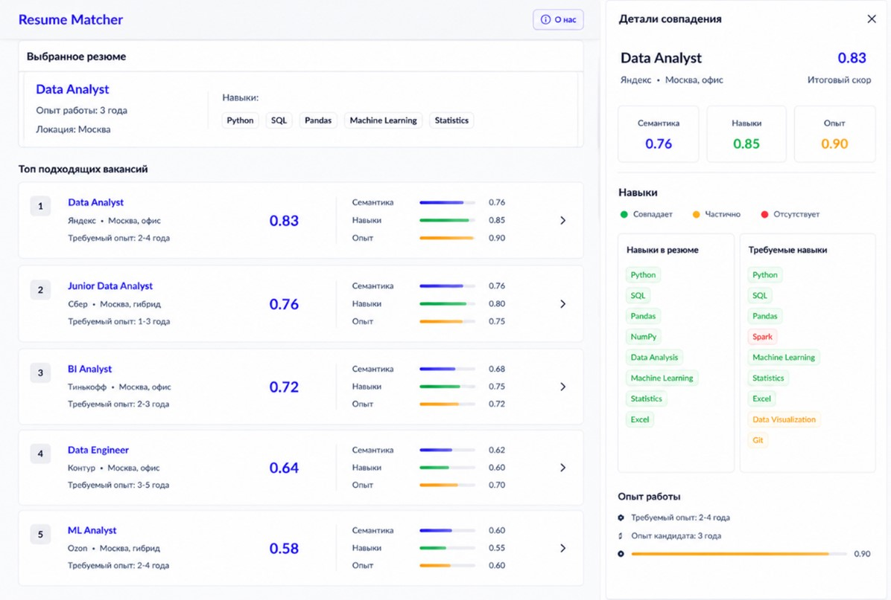

# Разработка системы для сопоставления резюме и текстовых описаний вакансий для специалистов в области анализа данных

Исполнитель:  
***Третьяков К.А.***

Научный руководитель: 
Старший преподаватель ДБДИП ФКН 
***Паточенко Е.А.***

Соруководитель:  
Специалист по интеллектуальному анализу данных и машинному обучению категории 2
Место работы: ООО "Ламода Тех" 
***Неволина А.С.***  

## Введение
Цель: разработка системы матчинга резюме и текстов вакансий для специалистов по анализу данных

# Получение данных
Этап включает в себя следующие шаги:
1) Развёртывание инфраструктуры хранения данных (ВМ) - настроена ВМ Yandex Cloud, создана БД PostgreSQL, созданы таблицы для хранения данных.
2) Разработка механизма сбора данных, сбор данных - разработан алгоритм парсинга вакансий и резюме с HH.ru. 
3) Автоматизация процесса сбора данных - с помощью Apache Airflow автоматизирован сбор данных.

Реализация данного этапа представлена в виде DAG'ов в Airflow (код в папке airflow-docker), а также в БД PostgreSQL

# Проведение EDA
Этап включает в себя следующие шаги:
1) Обработка данных, полученных парсингом карточек (шапки и основной информации)
2) Выделение признаков
3) Очистка текста
4) Подготовка датасетов к следующему этапу

В результате данного этапа для дальнейшей работы выделено ~12к релевантных текстов резюме и ~1400 релевантных текстов вакансий. Навыки кандидата и опыт работы выделены как отдельные признаки. 
Реализация данного этапа представлена в файле eda.ipynb

Для решения задачи сопостоавления вакансий и резюме были использованы следующие способы:
1. TF-IDF + LogisticRegression как baseline
2. TF-IDF + cosine similarity как альтернативный способ (попытка улучшить решение)

# Разработка baseline
## Формирование псевдоразметки (псевдоэталона)

Так как в исходных данных отсутствовала ручная экспертная разметка релевантных пар «резюме — вакансия», в работе была сформирована псевдоразметка.

Для каждой пары резюме и вакансии рассчитывались следующие показатели:

- skill_score — степень совпадения навыков кандидата с требованиями вакансии;
- exp_score — соответствие опыта кандидата минимальным требованиям вакансии;
- pseudo_score — итоговая псевдооценка соответствия пары.

Итоговая оценка рассчитывалась как взвешенная сумма:

$$
final\_score = 0.67 \cdot skill\_score + 0.33 \cdot exp\_score
$$

На основе pseudo_score формировался бинарный псевдотаргет:

- top 5% пар по pseudo_score -> target = 1
- bottom 20% пар по pseudo_score -> target = 0

Средняя часть пар не использовалась при обучении, чтобы снизить влияние неоднозначных примеров.

## Разработка моделей сопоставления
### TF-IDF + LogisticRegression

Модель использует лексическое представление объединенного текста пары «резюме-вакансия».
Текст пары преобразуется в TF-IDF-вектор, после чего логистическая регрессия предсказывает вероятность релевантности пары.

### Embeddings + LogisticRegression

Модель использует семантические векторные представления текстов, полученные с помощью SentenceTransformer.

Для пары «резюме — вакансия» формируются признаки на основе:

- абсолютной разности эмбеддингов
- покомпонентного произведения эмбеддингов

После этого полученные признаки передаются в модель LogisticRegression.

## Оценка качества

Оценка качества выполнялась двумя способами

### Метрики top-5 рекомендаций

Для каждого резюме модель формировала top-5 наиболее подходящих вакансий. Далее рассчитывались следующие метрики:

 - Mean Pseudo Score@5 — среднее значение псевдооценки среди top-5 рекомендаций;
 - Mean Skill Score@5 — среднее совпадение навыков среди top-5 рекомендаций;
 - Mean Exp Score@5 — среднее соответствие опыта среди top-5 рекомендаций.

 
| Модель | Mean Pseudo Score@5 | Mean Skill Score@5 | Mean Exp Score@5 |
|---|---:|---:|---:|
| TF-IDF + LogisticRegression | 0.713 | 0.642 | 0.855 |
| Embeddings + LogisticRegression | 0.541 | 0.382 | 0.864 |

### Классические метрики бинарной классификации

Дополнительно модели оценивались как бинарные классификаторы пар «резюме — вакансия» по псевдотаргету

Использовались следующие метрики:

- Accuracy
- Precision
- Recall
- F1-score
- ROC-AUC
- PR-AUC

| Модель | Accuracy | Precision | Recall | F1-score | ROC-AUC | PR-AUC |
|---|---:|---:|---:|---:|---:|---:|
| TF-IDF + LogisticRegression | 0.818 | 0.577 | 0.899 | 0.703 | 0.927 | 0.804 |
| Embeddings + LogisticRegression | 0.737 | 0.470 | 0.785 | 0.588 | 0.825 | 0.625 |

По результатам экспериментов модель TF-IDF + LogisticRegression показала лучшее качество по сравнению с моделью на эмбеддингах. Это связано с тем, что в задаче сопоставления резюме и вакансий большое значение имеют точные совпадения профессиональных терминов, технологий и навыков.

Реализация моделей и экспериментальной оценки представлена в файле baseline_new.ipynb.

# Результаты работы
Результат работы продемонстрирован в текстовой части работы ВКР_ТретьяковКА.docx

Шаблон демонстрации UI 

## План работы
1. Обзор источников
2. Обзор существующих решений
3. Постановка задачи
4. Получение данных
5. Проведение EDA (подготовка данных)
6. Разработка моделей сопоставления
7. Экспериментальная оценка
8. Реализация системы

